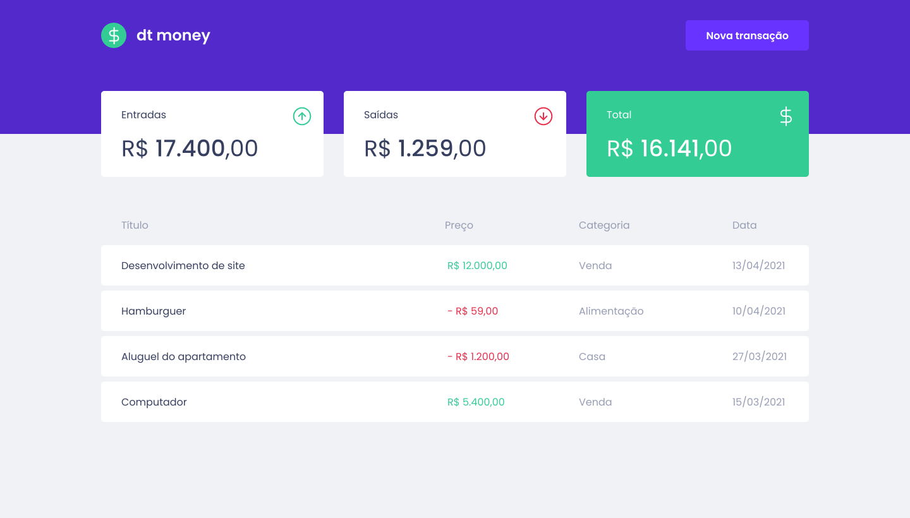
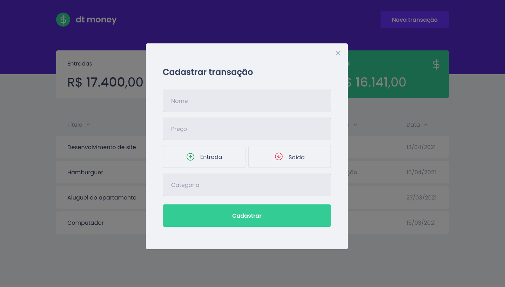

<h1 align="center">
  dtmoney 
</h1>

<p align="center">
  <a href="#-tecnologias">Tecnologias</a>&nbsp;&nbsp;&nbsp;|&nbsp;&nbsp;&nbsp;
  <a href="#-projeto">Projeto</a>&nbsp;&nbsp;&nbsp;|&nbsp;&nbsp;&nbsp;
  <a href="#-como-executar">Como executar</a>&nbsp;&nbsp;&nbsp;|&nbsp;&nbsp;&nbsp;
  <a href="#-layout">Layout</a>&nbsp;&nbsp;&nbsp;|&nbsp;&nbsp;&nbsp;
</p>

<p>


</p>

## 🚀 Tecnologias

Esse projeto foi desenvolvido com as seguintes tecnologias:

- HTML
- CSS
- JavaScript
- Typescript
- Reactjs
- React Modal
- Styled components
- Polished
- Axios
- Miragejs

## 🚀 Como executar

Clone o projeto e acesse a pasta do mesmo.

```bash
$ git clone https://github.com/Hugovarellaa/dtmoney
$ cd dtmoney
```

Para iniciá-lo, siga os passos abaixo:

```bash
# Instalar as dependências
$ yarn

# Iniciar o projeto
$ yarn dev
```

O app estará disponível no seu browser pelo endereço http://localhost:3000.
<br>
<br>

## 💻 Projeto

Chapter II - Rocketseat

## 🔖 Layout

Você pode visualizar o layout do projeto através [desse link](<https://www.figma.com/file/0xmu9mj2TJYoIOubBFWsk5/dtmoney-Ignite-(Copy)?node-id=0%3A1>). É necessário ter conta no [Figma](https://figma.com) para acessá-lo.
